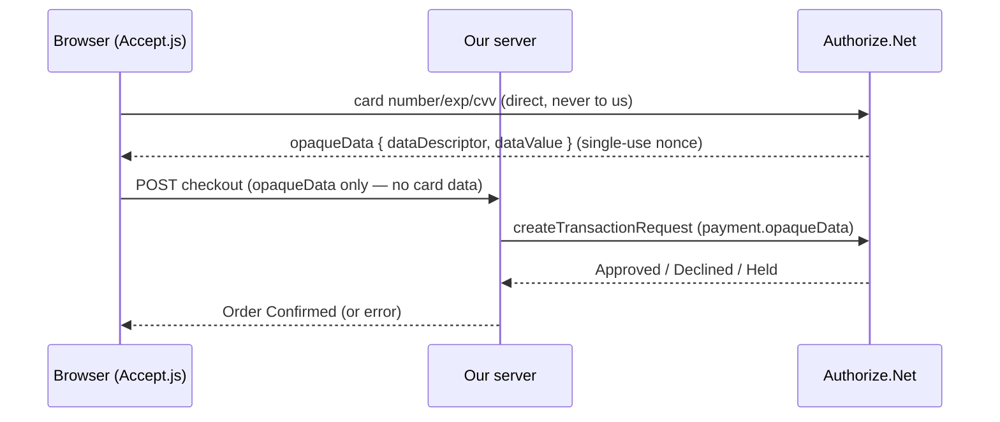

# Sweet Ring Donuts — Complete Build Guide

A start-to-finish account of how the **Sweet Ring Donuts** online shop was designed,
built, deployed, secured with HTTPS on a custom domain, and extended with **Apple Pay**
backed by **Authorize.Net**. This document captures the *why* behind each choice and the
*exact* steps and commands used, including every certificate, DNS record, and gotcha.

---

## Table of contents

1. [What we built](#1-what-we-built)
2. [Technology choices (and why)](#2-technology-choices-and-why)
3. [Source control: GitHub](#3-source-control-github)
4. [The .NET application](#4-the-net-application)
5. [Payments: Authorize.Net + Accept.js](#5-payments-authorizenet--acceptjs)
6. [Hosting on AWS Elastic Beanstalk](#6-hosting-on-aws-elastic-beanstalk)
7. [HTTPS with CloudFront](#7-https-with-cloudfront)
8. [Buying the domain on GoDaddy](#8-buying-the-domain-on-godaddy)
9. [TLS certificate with AWS ACM](#9-tls-certificate-with-aws-acm)
10. [Wiring the custom domain to CloudFront](#10-wiring-the-custom-domain-to-cloudfront)
11. [Apple Pay: the big picture](#11-apple-pay-the-big-picture)
12. [Apple Pay certificates explained](#12-apple-pay-certificates-explained)
13. [Registering & verifying the Apple Pay domain](#13-registering--verifying-the-apple-pay-domain)
14. [Apple Pay application code](#14-apple-pay-application-code)
15. [Shipping certificates & switching Apple Pay on](#15-shipping-certificates--switching-apple-pay-on)
16. [Making a real transaction](#16-making-a-real-transaction)
17. [Security model](#17-security-model)
18. [Problems we hit & how we solved them](#18-problems-we-hit--how-we-solved-them)
19. [Appendix: key identifiers & commands](#19-appendix-key-identifiers--commands)

---

## 1. What we built

A complete e-commerce storefront for a fictional donut shop:

- A browsable **menu** of donuts.
- A session-based **shopping cart**.
- A **checkout** that takes a real card payment through Authorize.Net (sandbox), and
  optionally **Apple Pay** for Safari/Apple-device shoppers.
- Hosted on AWS, fronted by CloudFront for HTTPS, on a **custom domain**
  (`shop.poseidon-team-donuts-shop.com`).

The guiding principle throughout: **raw card data never touches our server.** The browser
tokenizes the card (via Accept.js) or the device (via Apple Pay), and we only ever forward
an opaque, single-use token to Authorize.Net.

---

## 2. Technology choices (and why)

| Concern | Choice | Why |
|---|---|---|
| Web framework | **ASP.NET Core 8 MVC** | Mature, fast, first-class on AWS; server-rendered views keep the checkout simple and secure (no SPA token-handling complexity). |
| Language | **C#** | Strong typing, excellent tooling, great HTTP/JSON support for the gateway client. |
| Payments | **Authorize.Net** | Well-documented, supports both card tokenization (Accept.js) and Apple Pay decryption through the *same* opaque-data API. |
| Source control | **GitHub** | Ubiquitous, free private repos, integrates with everything. |
| Compute | **AWS Elastic Beanstalk** (.NET 8 on Amazon Linux 2023) | Managed platform — it provisions EC2, a reverse proxy, health checks, and rolling deploys without us managing servers. |
| HTTPS / CDN | **AWS CloudFront** | Free managed TLS at the edge, simple to put in front of the Beanstalk origin. |
| TLS certs | **AWS Certificate Manager (ACM)** | Free public certs with automatic renewal; integrates natively with CloudFront. |
| Domain registrar | **GoDaddy** | Where the team already had an account (AWS Route 53 registration was blocked on this Free-Tier account). |

---

## 3. Source control: GitHub

We initialized a Git repository and pushed to GitHub:

```bash
git init
git remote add origin https://github.com/abhishekcabhyankar/donutshop.git
git add -A
git commit -m "Initial commit"
git push -u origin main
```

**`.gitignore` discipline** is critical for a payments app. Ours excludes build output,
local config, and — importantly — **all certificate/key material**:

```gitignore
bin/
obj/
appsettings.*.local.json
publish/
*.zip
# Apple Pay / TLS certificate material — NEVER commit private keys or certs
*.pem
*.key
*.p12
*.pfx
*.cer
*.csr
certs/
```

Secrets (API keys, transaction keys) are **never** committed. Locally they live in
**.NET user-secrets**; in production they're **Elastic Beanstalk environment variables**.

---

## 4. The .NET application

### Structure

```
DonutShop.csproj          # ASP.NET Core 8 MVC project
Program.cs                # App startup & middleware pipeline
Controllers/              # Home, Cart, Checkout
Models/                   # Donut, Cart, CheckoutViewModel, AuthorizeNetOptions, ApplePayOptions
Services/                 # DonutCatalog, CartService, AuthorizeNetPaymentService
Views/                    # Razor views (Home, Cart, Checkout, Shared layout)
wwwroot/                  # Static assets (css/js/lib) + later .well-known
```

### Key pipeline decisions in `Program.cs`

- **Session-backed cart** — `AddSession` + `AddDistributedMemoryCache`, with an essential,
  HTTP-only, `SecurePolicy.Always` cookie.
- **Forwarded headers** — because CloudFront terminates TLS at the edge and talks to
  Beanstalk over plain HTTP, the app would otherwise think every request was insecure
  (dropping secure cookies and causing redirect loops). We honor the original scheme via:

  ```csharp
  options.ForwardedProtoHeaderName = "CloudFront-Forwarded-Proto";
  options.KnownNetworks.Clear();
  options.KnownProxies.Clear();
  ```

- **Typed HttpClient** for the payment service via `AddHttpClient<IPaymentService, AuthorizeNetPaymentService>()`.

---

## 5. Payments: Authorize.Net + Accept.js

### The flow (card path)



### Server-side highlights (`AuthorizeNetPaymentService.cs`)

- Builds a `createTransactionRequest` with `payment.opaqueData { dataDescriptor, dataValue }`.
- Treats response code **`1` (Approved)** *and* **`4` (Held for review)** as success — both
  mean the order was captured.
- Trims the **UTF-8 BOM** Authorize.Net prefixes onto JSON responses (it breaks parsers):

  ```csharp
  raw = raw.TrimStart('\uFEFF', '\u200B', ' ', '\n', '\r', '\t');
  ```

- Refuses to run if credentials are missing, returning a friendly "not configured" message.

### Configuration

`AuthorizeNetOptions` switches sandbox/production endpoints automatically. Sandbox URLs:

- API: `https://apitest.authorize.net/xml/v1/request.api`
- Accept.js: `https://jstest.authorize.net/v1/Accept.js`

Credentials set via user-secrets locally:

```bash
dotnet user-secrets set "AuthorizeNet:ApiLoginId" "<id>"
dotnet user-secrets set "AuthorizeNet:TransactionKey" "<key>"
dotnet user-secrets set "AuthorizeNet:PublicClientKey" "<public-client-key>"
```

---

## 6. Hosting on AWS Elastic Beanstalk

### Account & tooling

- IAM user `donutshop-deployer`, account `713353059605`, region `us-east-1`.
- Tools installed via Homebrew: **AWS CLI** and the **EB CLI**.

### Environment

- App: **`sweet-ring-donuts`**, environment **`sweet-ring-donuts-env`**.
- **Single-instance** `t3.small`, platform **.NET 8 running on 64-bit Amazon Linux 2023**.
- The app listens on `http://0.0.0.0:5000`; a **`Procfile`** tells Beanstalk how to start it:

  ```
  web: dotnet DonutShop.dll
  ```

### One-command deploys (`deploy-aws.sh`)

The script:

1. `dotnet publish -c Release -o ./publish`
2. Copies the `Procfile` into the publish folder and zips it as `deploy.zip`.
3. `eb deploy` the pre-built artifact.
4. `eb setenv` pushes configuration as environment variables, reading secrets from
   local user-secrets so nothing is hardcoded.

Production config uses the **double-underscore** convention (`AuthorizeNet__ApiLoginId`),
which .NET maps to the `AuthorizeNet:ApiLoginId` configuration key.

---

## 7. HTTPS with CloudFront

Beanstalk's default URL is plain HTTP. Rather than manage certs on the instance, we put
**CloudFront** in front:

- Distribution ID **`E1KAUBU3LAW72X`**.
- Origin = the Beanstalk environment, **HTTP-only**.
- **Viewer protocol policy: redirect-to-HTTPS.**
- Forwards **all cookies**, the **query string**, and the **`CloudFront-Forwarded-Proto`**
  header (so the app sees the true viewer scheme). **TTL 0** so nothing is cached (this is a
  dynamic, session-based app).
- Initially served on the default `https://dv2ih1brr0xrd.cloudfront.net`.

This is what made `UseForwardedHeaders` with `CloudFront-Forwarded-Proto` necessary (see §4).

---

## 8. Buying the domain on GoDaddy

Apple Pay on the Web **cannot be registered against a shared `*.cloudfront.net` domain** —
Apple requires a fully-qualified domain you control. We also discovered that **Route 53
domain registration was blocked** on this account:

```
AccessDeniedException ... Free Tier accounts are not supported for this service
```

So we purchased **`poseidon-team-donuts-shop.com`** at **GoDaddy** and used the subdomain
**`shop.poseidon-team-donuts-shop.com`** for the shop. DNS stays at GoDaddy; we add CNAME
records there.

---

## 9. TLS certificate with AWS ACM

CloudFront requires its certificate to live in **us-east-1**. We requested a DNS-validated
public certificate:

```bash
aws acm request-certificate --region us-east-1 \
  --domain-name shop.poseidon-team-donuts-shop.com \
  --validation-method DNS
```

ACM returned a **CNAME validation record**. Because GoDaddy auto-appends the domain, we
entered the host *relative* to the domain (dropping the suffix):

| Type | Name (Host) | Value |
|---|---|---|
| CNAME | `_e7adaaec6f886b124c7cd412323d2df6.shop` | `_b9aa473e4ba1673afc2c17b86c536f3a.jkddzztszm.acm-validations.aws` |

We then waited for issuance:

```bash
aws acm wait certificate-validated --region us-east-1 --certificate-arn <ARN>
# → ISSUED
```

> **Lesson:** ACM polls DNS on its own schedule. Once the CNAME resolves publicly
> (`dig +short` shows the `acm-validations.aws` target), issuance follows within minutes.

---

## 10. Wiring the custom domain to CloudFront

With the cert issued, we attached it to the distribution and added the alternate domain.
This is done by fetching the distribution config, editing two sections, and updating with
the current ETag:

1. **Aliases** → add `shop.poseidon-team-donuts-shop.com`.
2. **ViewerCertificate** → switch from the default CloudFront cert to the ACM cert:

   ```json
   {
     "ACMCertificateArn": "arn:aws:acm:us-east-1:713353059605:certificate/dffbac14-...",
     "SSLSupportMethod": "sni-only",
     "MinimumProtocolVersion": "TLSv1.2_2021",
     "CertificateSource": "acm"
   }
   ```

```bash
aws cloudfront update-distribution --id E1KAUBU3LAW72X \
  --distribution-config file://cf-update.json --if-match <ETag>
```

Finally, the **DNS CNAME** at GoDaddy that points the subdomain at CloudFront:

| Type | Name (Host) | Value |
|---|---|---|
| CNAME | `shop` | `dv2ih1brr0xrd.cloudfront.net` |

Verification:

```bash
curl -s -o /dev/null -w "%{http_code}\n" -L https://shop.poseidon-team-donuts-shop.com/
# → 200, title "Menu - Sweet Ring Donuts"
```

---

## 11. Apple Pay: the big picture

The single most important architectural insight:

> **Apple Pay reuses the exact same Authorize.Net `opaqueData` charge path as the card flow.**
> Only the `dataDescriptor` differs:
> - Card (Accept.js): `COMMON.ACCEPT.INAPP.PAYMENT`
> - Apple Pay: `COMMON.APPLE.INAPP.PAYMENT`
>
> The `dataValue` is the base64-encoded Apple Pay payment token. Authorize.Net **decrypts**
> it server-side. **So our charge code needed no changes at all.**

There are three distinct Apple-side artifacts, easy to confuse:

| Artifact | Purpose | Who holds the private key |
|---|---|---|
| **Merchant ID** (`merchant.com.yourdomain.sweetring`) | Identifies the merchant in Apple's system | n/a (identifier) |
| **Merchant Identity Certificate** | mTLS client cert for *merchant validation* (starting an Apple Pay session) | **Us** (on our server) |
| **Payment Processing Certificate** | Encrypts/decrypts the payment **token** | **Authorize.Net** |

---

## 12. Apple Pay certificates explained

### 12a. Merchant Identity Certificate (we own the key)

Used by our server to prove its identity to Apple during *merchant validation*. We generated
the key and CSR with OpenSSL (bypassing the macOS Keychain GUI entirely), uploaded the CSR
to the Apple portal, downloaded the `.cer`, and converted it to PEM:

```bash
# RSA 2048 key + CSR
openssl req -new -newkey rsa:2048 -nodes \
  -keyout apple_merchant_id.key -out merchant_id.csr \
  -subj "/CN=Apple Pay Merchant Identity"

# After downloading merchant_id.cer from Apple, convert DER → PEM
openssl x509 -inform der -in merchant_id.cer -out apple_merchant_id.pem
```

The certificate subject confirms the merchant identifier:

```
subject= UID=merchant.com.yourdomain.sweetring,
         CN=Apple Pay Merchant Identity:merchant.com.yourdomain.sweetring,
         OU=AKG7WRH943, O=Abhishek Abhyankar
notAfter=Jul 22 2028
```

### 12b. Payment Processing Certificate (Authorize.Net owns the key)

This is the certificate whose private key **decrypts the Apple Pay token**. The critical
discovery: **Authorize.Net generates this CSR for you.** The CSR they provided had:

```
Subject: C=US, ST=Washington, L=VISA, O=VISA, OU=Authorize.NET
Public Key Algorithm: id-ecPublicKey   (EC, NIST P-256 / prime256v1)
```

> **Two lessons:**
> 1. The Payment Processing key is an **EC P-256** key, *not* RSA (unlike the identity cert).
> 2. Because **Authorize.Net** generated the CSR, **they** hold the private key and do the
>    decryption. We simply upload the CSR to Apple, download the resulting certificate, and
>    (per Authorize.Net's flow) there was **nothing further to upload back** — they already
>    have the matching key. We never possess this key, which is exactly why our charge path
>    just forwards the opaque token.

> We had initially generated our *own* EC P-256 CSR as well; once we saw Authorize.Net's CSR
> we discarded ours for the processing path (it would only matter if a gateway expected the
> merchant to own the decryption key).

---

## 13. Registering & verifying the Apple Pay domain

Apple must confirm we control the domain the button runs on.

1. In the Apple portal: **Identifiers → (Merchant ID) → Merchant Domains → Add Domain** →
   `shop.poseidon-team-donuts-shop.com`.
2. Apple provides a **domain-association file** to download.
3. We placed it in the web root under `/.well-known/`. The file has **no extension**, which
   the default static-file middleware would 404, so `Program.cs` serves `/.well-known/*`
   explicitly as `text/plain`:

   ```csharp
   var wellKnownPath = Path.Combine(app.Environment.WebRootPath, ".well-known");
   if (Directory.Exists(wellKnownPath))
   {
       app.UseStaticFiles(new StaticFileOptions
       {
           FileProvider = new PhysicalFileProvider(wellKnownPath),
           RequestPath = "/.well-known",
           ServeUnknownFileTypes = true,
           DefaultContentType = "text/plain"
       });
   }
   ```

4. **Gotcha:** Apple's portal actually fetched the file at the **`.txt`** URL
   (`apple-developer-merchantid-domain-association.txt`). Our first attempt served only the
   extensionless name and verification **failed**. We added the `.txt` copy, redeployed, and
   verification **passed**. We now serve **both** names.

Verification check:

```bash
curl -s -o /tmp/a -w "%{http_code} %{content_type} %{size_download}\n" \
  https://shop.poseidon-team-donuts-shop.com/.well-known/apple-developer-merchantid-domain-association.txt
# → 200 text/plain 5772
```

Result in the portal: **Domain: verified** (expires Jan 6, 2027).

---

## 14. Apple Pay application code

All additions are **off by default** (`ApplePay:Enabled=false`) so production is unaffected
until configured.

### `Models/ApplePayOptions.cs`

Holds `Enabled`, `MerchantIdentifier`, `DisplayName`, `DomainName`, `MerchantIdCertPath`,
`MerchantIdKeyPath`, plus an `IsConfigured` gate that requires the switch *and* the cert paths.

### `Program.cs`

- Binds `ApplePayOptions`.
- **Antiforgery via header** so the merchant-validation `fetch()` (which posts JSON, not a
  form) can still carry a CSRF token: `AddAntiforgery(o => o.HeaderName = "RequestVerificationToken")`.

### `Controllers/CheckoutController.cs` — `ValidateMerchant`

When the shopper taps Apple Pay, the browser hands us a one-time **validation URL**. We call
it over **mutual-TLS** using the Merchant Identity certificate and return Apple's opaque
merchant session to the page. Defensive details:

- **SSRF guard** — only ever connect to `apple.com` / `*.apple.com` over HTTPS.
- **Certificate loading** — `X509Certificate2.CreateFromPemFile(...)` then **re-import via
  PKCS12** so the private key is usable for TLS client auth on every platform.
- **Relative cert paths** resolve against `ContentRootPath`, so a bundled `certs/` folder
  works on the server.

```csharp
if (!Uri.TryCreate(request.ValidationUrl, UriKind.Absolute, out var uri) ||
    uri.Scheme != Uri.UriSchemeHttps || !IsApplePayHost(uri.Host))
    return BadRequest(new { error = "Invalid validation URL." });

using var pem = X509Certificate2.CreateFromPemFile(certPath, keyPath);
var clientCert = new X509Certificate2(pem.Export(X509ContentType.Pkcs12));
handler.ClientCertificates.Add(clientCert);
// POST { merchantIdentifier, displayName, initiative:"web", initiativeContext:domain }
```

### `Views/Checkout/Index.cshtml`

- Loads Apple's `apple-pay-sdk.js` and renders an `<apple-pay-button>` (hidden until
  `ApplePaySession.canMakePayments()` is true).
- On `onvalidatemerchant` → calls our `ValidateMerchant` endpoint.
- On `onpaymentauthorized` → sets the hidden fields and submits the **existing** form:

  ```js
  document.getElementById("dataDescriptor").value = "COMMON.APPLE.INAPP.PAYMENT";
  document.getElementById("dataValue").value =
      btoa(unescape(encodeURIComponent(JSON.stringify(event.payment.token.paymentData))));
  form.submit();
  ```

The charge then flows through the unchanged `[HttpPost] Index` → `ChargeAsync` path.

---

## 15. Shipping certificates & switching Apple Pay on

The Merchant Identity cert/key must exist on the server for the mTLS call. We extended
`deploy-aws.sh` to **bundle them from outside the repo** (`~/applepay-certs/`) into the
deploy artifact and set the config — and to **gracefully disable** Apple Pay if the certs
aren't present:

```bash
APPLEPAY_CERT_DIR="${APPLEPAY_CERT_DIR:-$HOME/applepay-certs}"
if [ -f "$APPLEPAY_CERT_DIR/apple_merchant_id.pem" ] && [ -f "$APPLEPAY_CERT_DIR/apple_merchant_id.key" ]; then
  mkdir -p ./publish/certs
  cp "$APPLEPAY_CERT_DIR/apple_merchant_id."{pem,key} ./publish/certs/
  chmod 600 ./publish/certs/apple_merchant_id.key
  APPLEPAY_ENABLED="true"
fi
```

Environment variables set on Beanstalk (note `__` maps to `:`):

```
ApplePay__Enabled            = true
ApplePay__MerchantIdentifier = merchant.com.yourdomain.sweetring
ApplePay__DisplayName        = Sweet Ring Donuts
ApplePay__DomainName         = shop.poseidon-team-donuts-shop.com
ApplePay__MerchantIdCertPath = certs/apple_merchant_id.pem
ApplePay__MerchantIdKeyPath  = certs/apple_merchant_id.key
```

Post-deploy verification (driving a real session via curl) confirmed the checkout HTML
renders `apple-pay-button`, `apple-pay-sdk.js`, `applePayContainer`, the `ValidateMerchant`
URL, and `COMMON.APPLE.INAPP.PAYMENT`.

---

## 16. Making a real transaction

### Card path (any browser)

1. Browse the menu → **Add to cart** → **Checkout**.
2. Enter delivery details and a **sandbox test card**: `4111 1111 1111 1111`, exp `12/2029`,
   CVV `123`.
3. Accept.js tokenizes the card in the browser; we forward only the opaque token.
4. Authorize.Net approves → **Order Confirmed** with a transaction ID
   (verified live, e.g. Transaction ID `120085173696`, `$1.99`, *Approved*).

### Apple Pay path (Safari on an Apple device only)

1. On `https://shop.poseidon-team-donuts-shop.com`, the **Apple Pay button** appears.
2. Tap it → the Apple Pay sheet opens → authorize with Face ID/Touch ID.
3. `onvalidatemerchant` → our `ValidateMerchant` mTLS call returns the merchant session.
4. `onpaymentauthorized` → the base64 token is posted with `COMMON.APPLE.INAPP.PAYMENT`.
5. Authorize.Net decrypts and charges → **Order Confirmed**.

> **Why Safari-only?** `ApplePaySession` exists only in WebKit/Safari, and the card token is
> produced by the device's **Secure Enclave**, which only Apple's OS can access. On other
> browsers the button stays hidden and shoppers use the universal card form. (Android/Chrome
> users would need a *separate* Google Pay integration.)

---

## 17. Security model

- **No card data on our servers.** The browser/device tokenizes; we only ever see opaque,
  single-use tokens.
- **Secrets never in git.** API keys/transaction keys live in user-secrets (local) and EB
  env vars (prod). `.gitignore` blocks all `*.pem/*.key/*.p12/*.pfx/*.cer/*.csr`.
- **Single-use nonce handling.** After a failed attempt we clear the consumed Accept.js token
  from both the model and `ModelState` so the browser mints a fresh one.
- **CSRF** protection on all POSTs, including the JSON Apple Pay validation call (via header
  token).
- **SSRF guard** on `ValidateMerchant` — it only connects to `*.apple.com` over HTTPS.
- **HTTPS everywhere** — CloudFront redirects HTTP→HTTPS; secure, HTTP-only session cookie.
- **Transport hardening** — CloudFront viewer cert is `sni-only`, `TLSv1.2_2021` minimum.

### Known hardening TODO

The Merchant Identity **private key** currently ships inside the deploy bundle (→ S3 →
instance disk). Acceptable for sandbox; for real production it should move to **AWS Secrets
Manager** and be loaded at runtime.

---

## 18. Problems we hit & how we solved them

| Problem | Root cause | Fix |
|---|---|---|
| Held-for-review orders looked like failures | Only response code `1` treated as success | Also accept code `4` (held for review) |
| JSON parse errors from Authorize.Net | Responses prefixed with a UTF-8 **BOM** | `TrimStart('\uFEFF', …)` before parsing |
| Secure cookies dropped / redirect loops | CloudFront→EB hop is HTTP | `UseForwardedHeaders` with `CloudFront-Forwarded-Proto` |
| Couldn't register domain in Route 53 | **Free-Tier accounts blocked** from the registrar API | Bought the domain at GoDaddy instead |
| ACM stuck `PENDING_VALIDATION` | ACM polls on its own schedule | Add the CNAME, confirm it resolves, then `acm wait` |
| Apple domain verification **failed** | Apple fetched the `.txt` URL; we served only the extensionless name | Serve **both** names; redeploy; re-verify |
| Extensionless `.well-known` file 404'd | Static middleware skips unknown content types | Dedicated `/.well-known` provider with `ServeUnknownFileTypes` |
| mTLS client cert not usable for TLS | `CreateFromPemFile` yields an ephemeral key | Re-import via `Export(Pkcs12)` |
| Confusion over which cert decrypts | Two different certs (identity vs processing) | Authorize.Net owns the **processing** key; we own the **identity** key |

---

## 19. Appendix: key identifiers & commands

### Identifiers

```
GitHub:            github.com/abhishekcabhyankar/donutshop (origin/main)
AWS account:       713353059605   region us-east-1
EB app/env:        sweet-ring-donuts / sweet-ring-donuts-env (e-4a9mjh9jds)
EB platform:       .NET 8 on 64-bit Amazon Linux 2023 v3.11.2 (t3.small, single-instance)
EB origin:         http://sweet-ring-donuts-env.eba-yj5nqhek.us-east-1.elasticbeanstalk.com
CloudFront:        E1KAUBU3LAW72X  →  https://dv2ih1brr0xrd.cloudfront.net
Custom domain:     shop.poseidon-team-donuts-shop.com  (GoDaddy DNS)
ACM cert (us-east-1): arn:aws:acm:...certificate/dffbac14-5436-42ba-8e94-390b122ea10d
Apple Merchant ID: merchant.com.yourdomain.sweetring   (Team AKG7WRH943)
Sandbox test card: 4111 1111 1111 1111 · 12/2029 · CVV 123
```

### .NET (the SDK is not on the default PATH)

```bash
export DOTNET_ROOT=$HOME/.dotnet && export PATH=$HOME/.dotnet:$PATH
dotnet build -c Release
dotnet run --launch-profile https     # https://localhost:7292
```

### AWS / EB (Homebrew)

```bash
eval "$(/opt/homebrew/bin/brew shellenv)"   # puts aws + eb on PATH
bash deploy-aws.sh                          # publish, bundle, deploy, setenv
eb status sweet-ring-donuts-env
eb printenv sweet-ring-donuts-env | grep ApplePay
eb logs
```

### DNS records added at GoDaddy

```
CNAME  _e7adaaec6f886b124c7cd412323d2df6.shop  →  _b9aa473e...jkddzztszm.acm-validations.aws   (ACM validation)
CNAME  shop                                     →  dv2ih1brr0xrd.cloudfront.net                 (site)
```

### Apple Pay certificate commands

```bash
# Merchant Identity (we own the key)
openssl req -new -newkey rsa:2048 -nodes -keyout apple_merchant_id.key \
  -out merchant_id.csr -subj "/CN=Apple Pay Merchant Identity"
openssl x509 -inform der -in merchant_id.cer -out apple_merchant_id.pem   # DER → PEM

# Payment Processing CSR is generated by Authorize.Net (EC P-256); we only upload it to Apple.
openssl req -in CertificateRequest_csr.txt -noout -verify -text | grep -E "NIST CURVE|verify"
```

---

*Built start-to-finish: ASP.NET Core 8 MVC on AWS Elastic Beanstalk, fronted by CloudFront,
on a GoDaddy domain with an ACM certificate, taking card and Apple Pay payments through
Authorize.Net — with raw payment data never touching the server.*
